# nifpga-fifo-to-zmq
An unofficial rust multiprocess program to read data from an NI FPGA FIFO send to ZMQ PULL as fast as possible .
The ZMQ interface allow to read the FIFO data in other "slower" program such as a Python script even for high-bandwidth dataflux.

Disclaimer: The nifpga-fifo-to-zmq program is NOT an official NI library! This code is an independent and autonomous development, unaffiliated with NI.

### Getting started
Example:
```
nifpga-fifo-to-zmq -s 6AD321BBEEEEEEFFFFFFFCD9205CEEEB -r false -n RIO0 -f 2 -p 12345 --fifo-reading-buffer 10000 --dma-buffer-size 500000 -m 2 C:\bitfiles\MyBitfile.lvbitx
```
Usage:

```
Usage: nifpga-fifo-to-zmq.exe [OPTIONS] [BIT_FILE]

Arguments:
  [BIT_FILE]  Set the bit_file name
Options:
  -s, --signature <SIGNATURE>       Sets a custom config file [default: ]
  -n, --ni-address <NI_ADDR>        Turn debugging information on [default: RIO0]
  -r, --run <false>                 [default: false] [possible values: true, false]
  -c, --close-on-reset <false>      [default: false] [possible values: true, false]
  -f, --fifo <0>                    [default: 0]
      --dma-buffer-size <50000>     [default: 50000]
      --fifo-reading-buffer <5000>  [default: 5000]
  -p, --port <13123>                [default: 13123]
  -m, --min-packet <1>              [default: 1]
  -h, --help                        Print help
  -V, --version                     Print version
```
### How it works inside?



## FAQ ##

### Where I can find the `signature` of my FPGA bit file? ###

The NI FPGA `.lvbitx` files are XML text files.
The `signature` that you need to open the FPGA Session you can find in the  `.lvbitx` file by searching for `<SignatureRegister>`.
